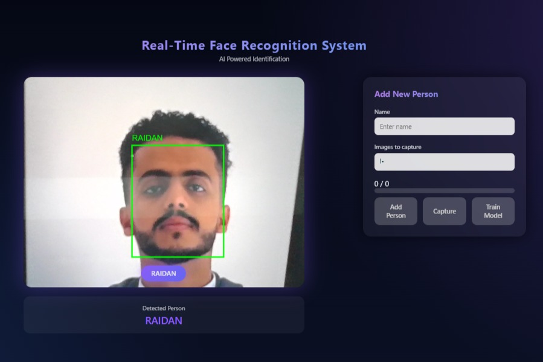

# Real-Time Face Recognition System


A real-time face recognition system built using **Deep Learning, Computer Vision, and Web Technologies**.

The system captures frames from a webcam, detects faces using **MTCNN**, generates embeddings using **FaceNet**, and identifies individuals by comparing embeddings with stored **centroids using cosine similarity**.

A web interface allows users to recognize faces in real time, add new people dynamically, and train the model directly from the browser.

The system is designed as a **modular AI application** consisting of:

* A **deep learning recognition pipeline**
* A **Flask REST API backend**
* A **web-based frontend interface**

This architecture makes the system flexible and allows it to be easily integrated into **larger intelligent systems** such as security platforms, attendance systems, or access control solutions.

---

# System Demo




The interface displays the live webcam feed, performs real-time face detection, and shows the predicted identity along with bounding boxes around detected faces.

Users can also add new individuals directly from the interface by capturing face images and retraining the recognition model.

---

# Features

* Real-time face recognition from webcam
* Face detection using **MTCNN**
* Face embeddings using **FaceNet**
* Identity prediction using **Cosine Similarity**
* Bounding box visualization
* Web-based interface
* Dynamic training directly from the UI
* Automatic centroid recomputation
* Flask REST API backend

Additional system capabilities include:

* Live face detection overlay on the camera stream
* Ability to add new identities without restarting the system
* Modular machine learning pipeline
* Clear separation between AI logic and web interface
* Easily extendable architecture for future improvements

---

# System Architecture

The recognition pipeline follows the standard deep learning workflow:

```
Camera Frame
      ↓
Face Detection (MTCNN)
      ↓
Face Embedding (FaceNet)
      ↓
Cosine Similarity Comparison
      ↓
Identity Recognition
```

Explanation of the pipeline:

1. **Camera Frame**
   The webcam continuously captures image frames in real time.

2. **Face Detection (MTCNN)**
   The system uses the MTCNN deep learning model to detect faces within each frame.

3. **Face Embedding (FaceNet)**
   Each detected face is converted into a **numerical embedding vector** using FaceNet.

4. **Cosine Similarity Comparison**
   The embedding is compared with stored identity vectors using cosine similarity.

5. **Identity Recognition**
   The system predicts the closest identity or labels the person as **Unknown** if no match is found.

---

# Technologies Used

### Programming Language

* Python

### Deep Learning

* PyTorch
* FaceNet (facenet-pytorch)

### Face Detection

* MTCNN

### Computer Vision

* OpenCV

### Machine Learning

* Scikit-learn

### Scientific Computing

* NumPy

### Web Backend

* Flask

### Frontend

* HTML
* CSS
* JavaScript

These technologies allow the system to combine **deep learning inference**, **real-time image processing**, and **web-based interaction** within a single application.

---

# Project Structure

```
real-time-face-recognition-system

dataset/                # training images (not included in repository)

models/                 # trained models
   embeddings.pkl
   centroids.pkl
   svm_classifier.pkl

server/
   app.py               # Flask backend API

src/                    # machine learning pipeline
   01_collect_data.py
   02_build_embeddings.py
   03_train_classifier.py
   04_realtime_test.py
   compute_centroids.py

web/                    # frontend interface
   index.html
   css/
   js/

images/
   interface.jpg        # UI preview image

run.py                  # start the full system
requirements.txt
README.md
```

The project is organized into separate modules to maintain clean architecture:

* **src/** contains the machine learning pipeline scripts.
* **server/** contains the Flask API responsible for communication between the frontend and the AI system.
* **web/** contains the user interface.
* **models/** stores trained recognition models.
* **dataset/** stores the face images used for training.

---

# Installation

Clone the repository:

```
git clone https://github.com/RAIDAN44/real-time-face-recognition-system.git
cd real-time-face-recognition-system
```

Install dependencies:

```
pip install -r requirements.txt
```

---

# Running the System

Start the system using:

```
python run.py
```

Then open:

```
http://localhost:8000/web/index.html
```

The browser interface will start the webcam stream and begin real-time face recognition.

---

# Face Recognition Pipeline

The system performs recognition in several steps:

1. Capture image frame from webcam
2. Detect faces using **MTCNN**
3. Extract embeddings using **FaceNet**
4. Compare embeddings with stored centroids
5. Identify the closest match using **cosine similarity**

If the similarity score exceeds a defined threshold, the identity is considered a match. Otherwise, the system labels the person as **Unknown**.

---

# API Endpoints

The backend exposes several REST API endpoints used by the web interface.

### Recognize Face

```
POST /api/recognize
```

Receives a camera frame and returns the recognized identity.

Response example:

```
{
  "name": "RAIDAN",
  "box": [120, 80, 240, 200]
}
```

---

### Start Training Session

```
POST /api/start_session
```

Creates a new training session used to collect face images for a new identity.

Returns a session ID that is used for subsequent capture requests.

---

### Capture Image

```
POST /api/capture
```

Captures a frame from the webcam and extracts the face embedding.

The embedding is stored temporarily in memory during the training session.

---

### Train Model

```
POST /api/train
```

Triggers the training pipeline and updates the stored recognition models.

Updates:

* embeddings.pkl
* centroids.pkl

These files contain the learned identity representations used during recognition.

---

# Dataset and Models

The dataset and trained models are **not included in this repository**.

This is intentional for several reasons:

1. Face datasets can be large and may exceed GitHub storage limits.
2. Model files are automatically generated during training.
3. Keeping them outside the repository keeps the project lightweight and portable.

Users must collect their own dataset of face images before training the system.

Example dataset structure:

```
dataset/

   PERSON_1/
      img1.jpg
      img2.jpg
      img3.jpg

   PERSON_2/
      img1.jpg
      img2.jpg
      img3.jpg
```

After collecting images, run the training pipeline to generate the model files inside the **models/** directory.

---

# Generated Model Files

After training the system, several files will be generated automatically:

**embeddings.pkl**
Stores the face embeddings extracted from all training images.

**centroids.pkl**
Stores the centroid vector representing each identity.

**svm_classifier.pkl**
Optional classifier trained on the embeddings for identity prediction.

These files are created during training and therefore are not stored in the repository.

---

# System Integration

This project is designed as a **core recognition engine** that can be integrated into larger intelligent systems.

Possible integration scenarios include:

* Smart attendance systems
* Secure building access control
* Automated door unlocking systems
* Surveillance and monitoring systems
* Identity verification platforms
* Visitor management systems

For example:

A company could integrate this system with an **access control system**, where the door unlocks automatically when an authorized employee is recognized.

Similarly, a university could integrate it with an **attendance tracking system** that records student attendance automatically when their face is detected.

Because the backend is built using **Flask REST APIs**, the system can easily communicate with:

* Mobile applications
* Web dashboards
* IoT devices
* Security systems
* Smart home automation platforms

---

# Future Improvements

* Multi-face tracking
* GPU acceleration
* Mobile camera support
* Cloud deployment
* Database integration
* User management system
* Real-time analytics dashboard

---

# Author

**Raidan Al-khateeb**

Artificial Intelligence
Computer Vision Project
